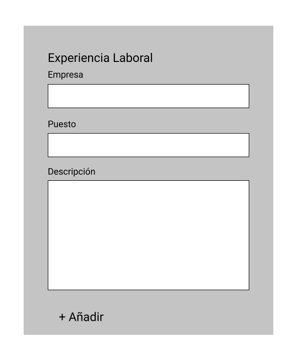

**Disclaimer**: Esta tarea la hice originalmente en Angular 7 y estamos en proceso de actualizar a Angular 8 por esta razón puede que las cosas cambien en versiones más recientes.

----------

Uno de los retos más raros que he tenido ha sido trabajar con formularios dinámicos en Angular.

### ¿Qué es un formulario dinámico?

Un formulario dinámico es cuando un formulario permite a un usuario generar campos con una acción. El formulario nunca va a saber cuantos campos quiere tener un usuario, por lo que el usuario tiene todo el control sobre la cantidad de campos que se generan. El usuario también puede quitar campos y eso es lo que hace la forma dinámica.

Un ejemplo es un típico formulario para hacer un currículum en internet. La parte de educación y experiencia laboral se ven algo como así:




Angular nos permite tener formularios dinámicos con su módulo de formularios reactivos o `ReactiveFormsModule`. Un formulario reactivo es un tipo de formulario que se crea desde el controlador. En lugar de tener el formulario 100% en la plantilla, desde el controlador se crean los campos y se añaden características como las validaciones.

Hacer formularios directo en la plantilla parece ser más fácil al principio, pero si se tiene un formulario muy complejo es mejor hacerlo con formularios reactivos. Además parece que los formularios de plantilla serán deprecados en versiones futuras de Angular.

### ¿Cómo se crea un formulario reactivo?

Lo primero que hay que hacer es añadir el módulo de formularios reactivos a nuestro módulo.

```javascript
import { NgModule }      from '@angular/core';
import { BrowserModule } from '@angular/platform-browser';
import { ReactiveFormsModule } from '@angular/forms';

import { AppComponent }  from './app.component';

@NgModule({
  imports:      [ BrowserModule, ReactiveFormsModule ],
  declarations: [ AppComponent ],
  bootstrap:    [ AppComponent ]
})
export class AppModule { }
```

Ya que tenemos el módulo importado, tendremos todas las herramientas para nuestro formulario dinámico disponibles en nuestra aplicación.

Ahora en nuestro controlador, lo primero que hay que hacer es definir dos cosas:

- Un `FormBuilder` que nos va a ayudar a construir el formulario
- Un `FormGroup` que va a ser nuestro formulario

Para el `FormBuilder`, tenemos que definirlo en el constructor del componente.

```javascript
constructor(private fb: FormBuilder) {}
```

Y el `FormGroup` sólo lo definimos como una variable en el componente.

```javascript
formulario: FormGroup;
```

Después, usando el método de `ngOnInit()`, mandamos llamar a la función que va a crear el formulario. Esta función se puede llamar como sea, yo la llamé `crearFormulario` porque soy mega original.

```javascript
crearFormulario() {
  this.formulario = this.fb.group({
    experienciaLaboral: new FormControl('')
  });
}
```

Si este fuera un formulario normal, con esto ya tendríamos un formulario con un campo, pero queremos un formulario dinámico así que hay que seguir. 

### ¿Cómo se hace un formulario dinámico?

Ahora es tiempo de introducir otra herramienta del módulo de formularios reactivos, se llama `FormArray`. Un `FormArray` es un arreglo de `FormControl`. Se comporta muy parecido a un arreglo normal y tiene ciertos métodos propios que hace muy sencillo agregar y quitar elementos del mismo. Para usarlo vamos a modificar nuestro método `crearFormulario`.


```javascript
crearFormulario() {
  this.formulario = this.fb.group({
    experienciaLaboral: this.fb.array([])
  });
}
```

Como `FormBuilder` ya incluye todas estas heramientas, no necesitamos definir un nuevo `FormArray` con `new FormArray([])`. Los dos métodos son válidos, pero si ya tenemos el FormBuilder definido, hay que usarlo.

A mi gusto personal, prefiero crear una función para añadir campos al `FormArray` que definirlo en el formulario inicial. En el caso de este ejemplo, voy a crear un `FormGroup` con 3 campos, y cada uno de estos grupos será añadido al arreglo llamado experiencial laboral.

Ahora les voy a dar un consejo buenísimo que aprendí en mi nuevo trabajo: hay que crear una función de `get` para conseguir el arreglo y así no hacernos mil bolas a la hora de manipularlo.

```javascript
get experienciaLaboral(): FormArray {
  return this.formulario.get('experienciaLaboral') as FormArray;
}
```

Este `get` nos va a permitir manejar el arreglo de manera mucho más sencilla que escribir todo cada vez y además hará que el código sea mucho más legible para otros.

Ya que tenemos nuestro `get`, podemos proseguir a crear el grupo que le vamos a poner:

```javascript
anadirExperienciaLaboral() {
  const trabajo = this.fb.group({
    empresa: new FormControl(''),
    puesto: new FormControl(''),
    descripcion: new FormControl('')
  });
  
  this.experienciaLaboral.push(trabajo);
}
```

Cada vez que llamemos a `anadirExperienciaLaboral` vamos a generar un `FormGroup` con 3 campos: empresa, puesto y descripción. Ya que esté creado, se va a añadir al arreglo de `experienciaLaboral`. Todo de una manera muy sencilla por todo el código que ya escribimos.

No se te olvide añadir esta función a `ngOnInit` justo abajo de la de `crearFormulario` para añadir campos la primera vez.

Ahora, ¿cómo lo vemos en la plantilla?

### ¿Cómo es la plantilla de un formulario dinámico?

La plantilla no es tan diferente que la de un formulario hecho con base en plantillas. Sin embargo, hay detalles que tenemos que tener en cuenta a la hora de generarlo.

Una cosa que me tuvo atorada mucho tiempo, fue olvidar poner el nombre del arreglo en la plantilla antes de hacer un ciclo `for` para generar los campos.

```html
<form [formGroup]="formulario">
  <div formArrayName="experienciaLaboral">
    <div *ngFor="let trabajo of experienciaLaboral.controls">
      <input>
    </div>
  </div>
</form>
```

El atributo de `formArrayName` es fundamental para que nuestra plantilla sepa que va a recibir un arreglo dentro del formulario. Si esto no se define, los campos no aparecerán en la plantilla.

Otra cosa importante es que aunque tenemos nuestro `get` para `experienciaLaboral`, el `FormArray` no funciona como un arreglo normal por el que podemos iterar. Por eso es importante definir que vamos a iterar por los controles del arreglo. Los controles son todos los `FormGroups` que se han añadido al `FormArray`.

Para mostrar los campos que queremos es necesario añadir el código para mostrarlos:

```html
<form [formGroup]="formulario">
  <h3>
    Experiencia Laboral:
  </h3>
  <div formArrayName="experienciaLaboral">
    <div *ngFor="let trabajo of experienciaLaboral.controls">
      <div>
        <label>Empresa:</label><br />
        <input type="text" />
      </div>
      <div>
        <label>Puesto:</label><br />
        <input type="text" />
      </div>
      <div>
        <label>Descripción:</label><br />
        <textarea></textarea>
      </div>
      <hr />
    </div>
  </div>
</form>
```

### ¿Cómo se vuelve este show dinámico?

Como lo mencioné al principio, el chiste de los formularios dinámicos es que el usuario pueda añadir y quitar campos a voluntad. En el caso de este formulario, no se van a poder añadir o quitar campos individuales, sino todo un grupo completo a la vez.

Para añadir más campos hay que crear un botón en la plantilla que llame a la función de `anadirExperienciaLaboral`, algo así:

```html
<button (click)="anadirExperienciaLaboral()">
  + Añadir
</button>
```

Este botón se puede poner afuera del `*ngFor` para que aparezca una vez en la plantilla.

En el caso de quitar campos del formulario, hay que agregar un botón para borrar dentro de cada grupo que añadimos. Pero primero hay que crear la función que se va a encargar de borrar en nuestro controlador.

```javascript
borrarTrabajo(indice: number) {
  this.experienciaLaboral.removeAt(indice);
}
```

Se podrán dar cuenta que la función que cree se llama `borrarTrabajo` y que recibe un índice. Este índice es el mismo índice que tiene el grupo en el arreglo y para conseguirlo desde la plantilla hay que modificar nuestro `*ngFor` de la siguiente manera:

```html
<div *ngFor="let trabajo of experienciaLaboral.controls; let i = index;">
```

Esa variable `i` va a contener el índice, lo que le va a decir al método `removeAt` cual elemento del arreglo tiene que borrar.

En la plantilla el botón para borrar va de la siguiente manera:

```html
<button (click)="borrarTrabajo(i)">Borrar</button>
```

Y así es como ya se pueden añadir y borrar campos a nuestro formulario de manera dinámica.

El código de este ejemplo se ve muy sencillo, pero la primera vez que lo tuve que hacer se me complicó muchísimo. En la documentación no estaba muy bien explicado como funcionan los `FormArray`, tampoco como se muestran en la plantilla. Mucho menos había explicaciones sobre como validar todo esto para ver si el formulario estaba correcto antes de mandarlo. Este post sólo es la primera parte de una serie que puede ser enorme y que estaré escribiendo poco a poco.

Aquí abajo les dejo el proyecto final en Glitch y lo estaré usando como base para los siguientes posts.

<!-- Copy and Paste Me -->
<div class="glitch-embed-wrap" style="height: 420px; width: 100%;">
  <iframe
    src="https://glitch.com/embed/#!/embed/nonchalant-saturday?path=src/app/app.component.html&previewSize=100"
    title="nonchalant-saturday on Glitch"
    allow="geolocation; microphone; camera; midi; vr; encrypted-media"
    style="height: 100%; width: 100%; border: 0;">
  </iframe>
</div>

----------

Espero que este pequeño ejemplo les sirva para entender mejor los formularios reactivos y dinámicos. Son herramientas muy últiles para hacer aplicaciones con funcionalidades más complejas. En la siguiente parte escribiré sobre validación y como crear validaciones dinámicas y como aplicarlas a diferentes partes del formulario.
