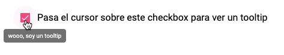

Hoy fue un día muy feliz para mí porque acabamos nuestro MVP (minimum viable product) que es la primera entrega de nuestra aplicación. Todo iba muy bien hasta que nuestro Project Manager nos dijo que agregáramos un tooltip a un checkbox para describir una función de la aplicación.



Ahí fue donde iniciaron los problemas... aunque lo bueno es que ahora les traigo esta entrada con mi experiencia para que no pasen 3 horas buscando en Google, GitHub y StackOverflow una solución.

## ¿Cómo funcionan los tooltips en Angular Material?

La verdad es que funcionan como por arte de magia. Lo que se tiene que hacer es:

- Importar el módulo de `MatTooltipModule` en `app.module.ts`
- Definir en qué elemento queremos mostrar un tooltip

```html
<button
  matTooltip="wooo, soy un tooltip"
>
  Pasa sobre mí para ver un tooltip
</button>
```

- Por último configurar el tooltip como quieras

```html
<button
  matTooltip="wooo, soy un tooltip"
  matTooltipPosition="above | below | left | right | before | after"
  matTooltipClass="clase-de-css-para-personalizar"
>
  Pasa sobre mí para ver un tooltip
</button>
```

Hasta ahora todo parece bien sencillo ¿no? ¡Pues no!

Vamos a probar poniendo un tooltip dentro de un checkbox, no más para ver como sería todo en un mundo ideal:

```html
<mat-checkbox
  checked="checked"
  matTooltip="Soy un tooltip"
>
  Soy un checkbox
</mat-checkbox>
```

Si pones esto en un aplicación, no va a haber un error. El tooltip simplemente no va a aparecer.

Esto sucede porque el checkbox no le pasa el evento de `focus` al tooltip, entonces el tooltip se queda ahí sin saber que hacer. Hay un Pull Request por ahí para arreglarlo, pero parece que hay una forma usando una cosa llamada FocusMonitor que te deja saber cuando el checkbox está en foco y así poder llamar al tooltip desde el controlador.

La verdad es que hacer setup del FocusMonitor se me hizo mega complejo para la cosa que quiero hacer y mejor intenté poner el tooltip en un `span` y llamarlo con los eventos de `mosuseenter` y `mouseleave` del checkbox.

```html
<div>
  <mat-checkbox
    (mouseenter)="tooltip.show()"
    (mouseleave)="tooltip.hide()"
  >
    <span
        #tooltip="matTooltip"
        matTooltip="wooo, soy un tooltip"
        matTooltipPosition="below"
    ></span>
    Pasa el cursor sobre este checkbox para ver un tooltip
  </mat-checkbox>
</div>
```

Así que queda sencillo:

- Con `mouseenter` se manda llamar al tooltip para que se muestre
- En `mouseleave` se le indica que tiene que esconderse
- El código no es complejo y es fácil de entender e implementar

Aquí les dejo un StackBlitz con esta pequeña app corriendo. Intenté hacerla en Glitch pero creo que Angular Material mató su CI 😅.

<iframe width="590" height="600" src="https://stackblitz.com/edit/angular-zhhokm?embed=1&file=src/app/app.component.html"></iframe>
