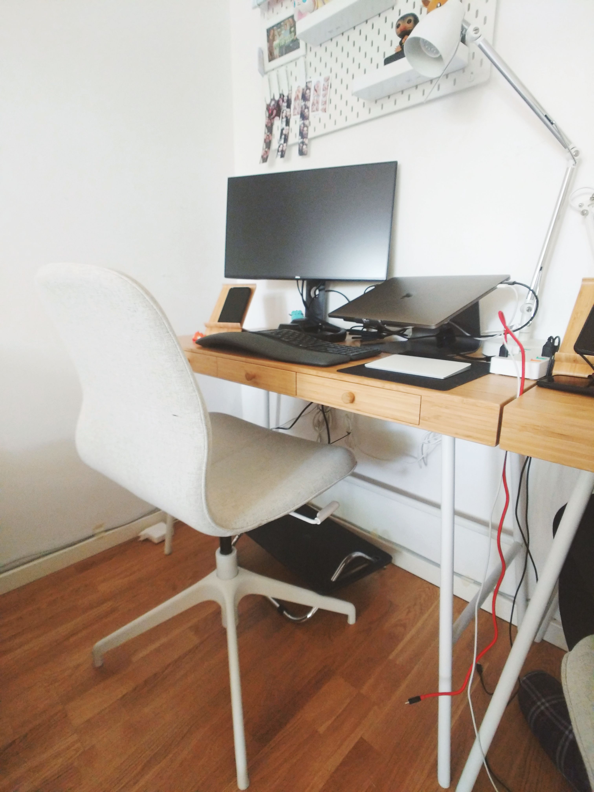
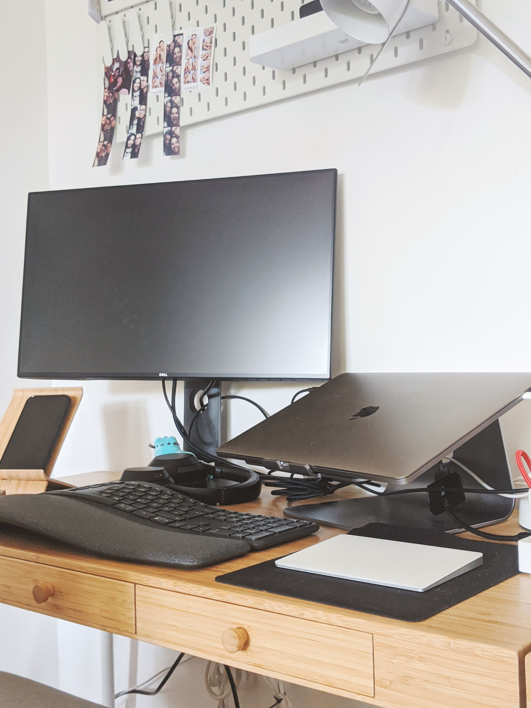
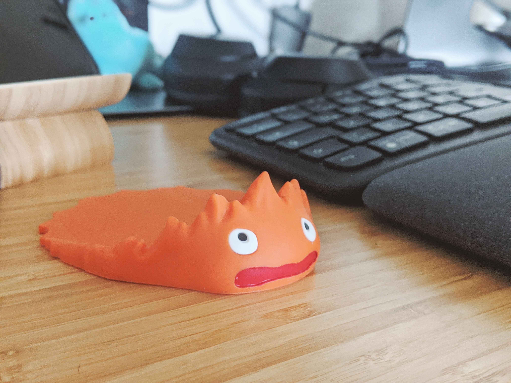
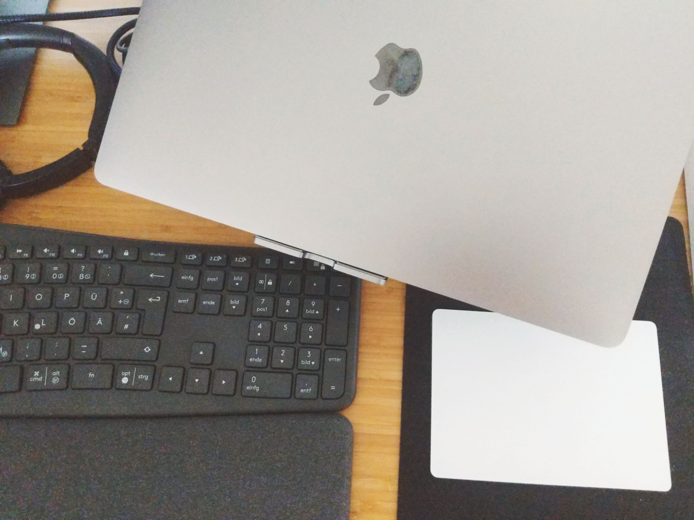
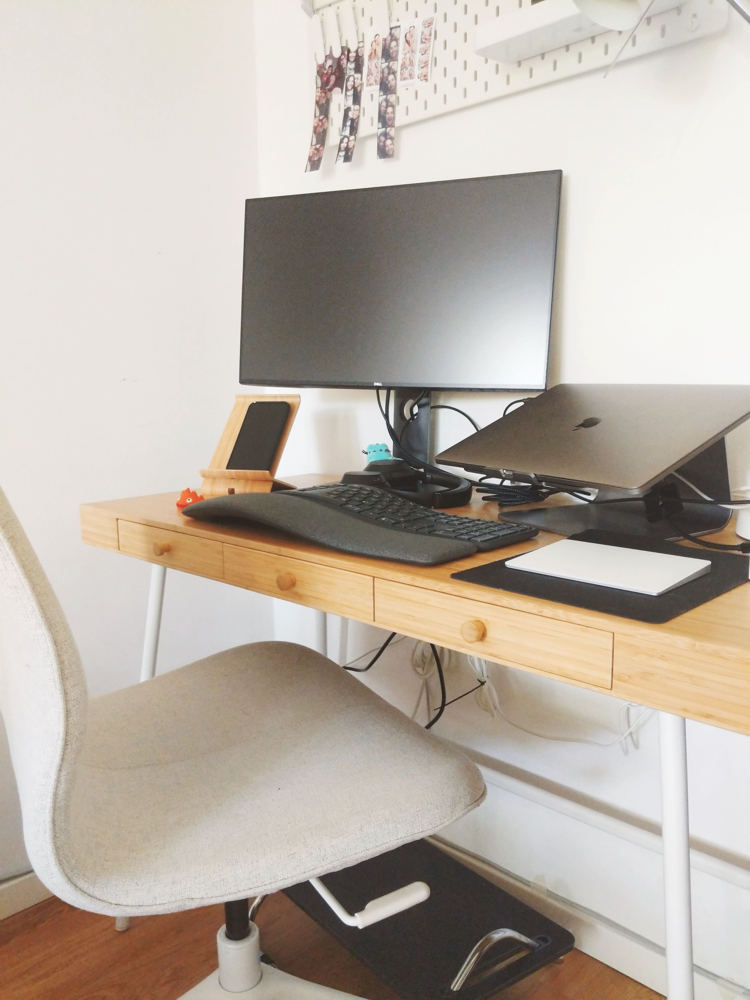

_Quiero empezar este post reconociendo el gran privilegio de tener un trabajo estable, de tiempo completo, que me permite trabajar desde mi casa. No todos lo tenemos y reconozco el valor que tienen aquellos que salen todos los días para mantener a su familia durante esta situación._

---

Desde que nos mudamos al departamento donde vivimos actualmente, quisimos tener un espacio dedicado para el trabajo. Mi prometido y yo somos ingenieros en software y ocasionalmente trabajamos desde casa. También tenemos varios hobbies que involucran usar la computadora, así que tener unos buenos escritorios y unas sillas apropidas para trabajar era prioridad para nosotros.

Con el tiempo hemos agregado cosas para hacer nuestro espacio de trabajo más cómodo. Ahora que llevamos más de un mes trabajando desde casa, la inversión en nuestro espacio de trabajo ha valido muchísimo la pena. Podemos trabajar cómodamente, separar nuestro trabajo del resto de la casa y mantenernos concentrados durante el día.

Mi escritorio en particular se ve así:

- Escritorio - [Lillåsen](https://www.ikea.com/de/de/p/lillasen-schreibtisch-bambus-90278277/) de IKEA
- Silla - [Långfjäll](https://www.ikea.com/de/de/p/langfjaell-konferenzstuhl-gunnared-beige-schwarz-s59174965/) de IKEA
- Descansa Pies - [Dagotto](https://www.ikea.com/de/de/p/dagotto-fussstuetze-schwarz-40240989/) de IKEA
- Lámpara - [Forså](https://www.ikea.com/de/de/p/forsa-arbeitsleuchte-weiss-30439117/) de IKEA, la que tengo en mi escritorio no la encontré en el sitio pero esta es la de mi prometido
- Stand para celular/tablet - [Sigfinn](https://www.ikea.com/de/de/p/sigfinn-mobiltelefonhalter-bambusfurnier-30383059/) de IKEA

Sí, somos totalmente IKEA.

- Stand para laptop: [mStand](https://www.amazon.de/-/en/gp/product/B01F01DRW6/) de Rain Design
- Hub para cargar dispositivos USB de [Aukey](https://www.amazon.de/-/en/gp/product/B01HZF7CJO/)
- Monitor [Dell U2419H](https://www.amazon.de/-/en/gp/product/B07JDGSPFM/)
- Teclado [Logitech Ergo K860](https://www.logitech.com/de-de/product/k860-split-ergonomic-keyboard?crid=27), este lo compré con descuento de mi empresa
- Audífonos [Sony WH-1000XM3](https://www.amazon.de/-/en/WH-1000XM3-Bluetooth-Canceling-headphones-Headphones/dp/B07GDR2LYK/)
- Apple Magic Trackpad 2
- Macbook Pro 15 pulgadas, es la del trabajo
- Macbook Air 13 pulgadas, es la personal
- Y muchos, muchos cables

---

La rutina que medio me he hecho ha sido la siguiente:

Despierto cerca de las 8:00, me baño y arreglo para trabajar. Normalmente me maquillo para trabajar porque me gusta estar arreglada, pero no es algo que haga diario o a fuerza. Normalmente desayunamos un cereal en frente de la compu y empieza el día de trabajo.

Mi primer junta del día siempre es mi stand up a las 9:45, así que antes de eso debo de estar conectada y revisando mis tareas del día. Dependiendo del día, a veces tengo juntas o a veces no tengo nada agendado. Sin embargo, tengo varias video llamadas al día para platicar con mis compañeros sobre el proyecto en el que estamos trabajando.

A las 11:45 sale mi recordatorio de la comida, así que por ahí de las 12 me levantó del escritorio y cocino. Si pedimos comida a domicilio, entonces pedimos antes de las 12 y esperamos a que llegue. Tratamos de comer juntos y en la cocina para tener un verdadero respiro del trabajo. Entre 45 minutos y 1 hora es lo que nos damos para comer y regresamos a trabajar.

Durante el tiempo de trabajo me doy 2 descansos de 15 minutos para preparar té, descansar mis ojos y estirar un poco las piernas.

El día de trabajo termina a las 17:00, a veces media hora más. Normalmente me pongo a ver YouTube o a jugar Animal Crossing. Algunas veces vamos a caminar después del trabajo o a hacer algo que tenga pendiente como sacar la basura o ir al super mercado.

Estuve haciendo ejercicio constante durante unas 2 o 3 semanas pero no lo incluyo en la rutina porque no es algo que hago diario a cierto tiempo. Lo hago cuando tengo ganas y no siempre a la misma hora.

Mi rutina diaria no difiere mucho de mi rutina normal sin pandemia. La única diferencia es que no tengo que tomarme tiempo para llegar a la oficina. Aún así extraño mucho a mis compañeros e ir a la oficina. Me gusta mucho socializar con mi equipo y aunque hablamos mucho, no es lo mismo.

¿Ustedes cómo se han sentido con la pandemia?
